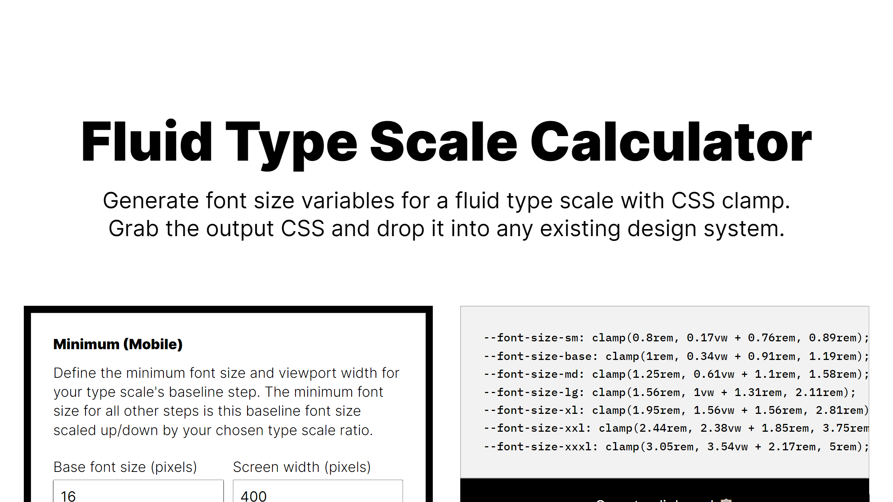

# Fluid Type Scale Calculator

> Generate font size variables for a fluid type scale with CSS clamp.

## Overview

Customize everything, grab the output CSS, and drop it into any design system. Share the URL with your team members or use it to document your CSS.

### Features

- Fully customizable parameters for everything:
  - Baseline min/max font size, screen width, type scale.
  - The names of the steps in your type scale.
  - The prefix to use for the variable names.
  - The max number of decimal places in the output.
  - Whether to show output in rems or pixels.
  - The resolved pixel value of 1rem.
- Output CSS variables for fluid font sizing.
- Live preview table. Pick a font and enter some sample text to fine-tune the results.
- Link sharing.

### Link Sharing

The `/calculate` route accepts the following query parameters and types. All parameters except boolean flags are required. Booleans that are not specified in the URL are treated as unchecked (`false`).

| Param               | Description                                                                                                                                                                                                                                                                 | Type                     | Constraints                                                                                                                                 |
| ------------------- | --------------------------------------------------------------------------------------------------------------------------------------------------------------------------------------------------------------------------------------------------------------------------- | ------------------------ | ------------------------------------------------------------------------------------------------------------------------------------------- | -------------------------------------------------- |
| `minFontSize`       | The minimum font size for the base step                                                                                                                                                                                                                                     | `number`                 | `> 0 && < maxFontSize`                                                                                                                      |
| `minWidth`          | The viewport or container width corresponding to the minimum font size                                                                                                                                                                                                      | `number`                 | `> 0 && < maxWidth`                                                                                                                         |
| `minRatio`          | The type scale ratio for the minimum font size of each step                                                                                                                                                                                                                 | `number`                 | `> 0 && < maxRatio`                                                                                                                         | `1.25`                                             |
| `maxFontSize`       | The maximum font size for the base step                                                                                                                                                                                                                                     | `number`                 | `> 0 && > minFontSize`                                                                                                                      | `19`                                               |
| `maxWidth`          | The viewport or container width corresponding to the maximum font size                                                                                                                                                                                                      | `number`                 | `> 0 && > minWidth`                                                                                                                         | `1280`                                             |
| `maxRatio`          | The type scale ratio for the maximum font size of each step                                                                                                                                                                                                                 | `number`                 | `> 0 && > minRatio`                                                                                                                         | `1.333`                                            |
| `steps`             | A comma-separated list of names for your type scale steps, in ascending order of font size                                                                                                                                                                                  | `string`                 | Comma-separated list. Step names must be alphanumeric, with no spaces. No duplicates are allowed.                                           | `sm,base,md,lg,xl,xxl,xxxl`                        |
| `baseStep`          | The name of the base step                                                                                                                                                                                                                                                   | `string`                 | Non-empty string. Must appear in `steps`.                                                                                                   | `base`                                             |
| `prefix`            | The naming convention to use for the output CSS variables                                                                                                                                                                                                                   | `string`                 | Non-empty alphanumeric string.                                                                                                              | `font-size`                                        |
| `includeFallbacks`  | Whether to include fallback variables in the CSS output for browsers that don't support clamp.                                                                                                                                                                              | `on`, `true`, or `false` |
| `useRems`           | Whether to use rems for font sizing.                                                                                                                                                                                                                                        | `on`, `true`, or `false` |                                                                                                                                             |
| `useContainerWidth` | Whether to use container width (cqi) instead of viewport width.                                                                                                                                                                                                             | `on`, `true`, or `false` |                                                                                                                                             |
| `remValue`          | The computed pixel value of `1rem`. Useful if your app changes the root font size (e.g., with the popular [`62.5%` font size trick](https://www.aleksandrhovhannisyan.com/blog/62-5-percent-font-size-trick/)). Note: This parameter has no effect if `useRems` is omitted. | `number`                 | `> 0`                                                                                                                                       | `16`                                               |
| `decimals`          | The number of decimal places to round the output to.                                                                                                                                                                                                                        | `int`                    | `>= 0 && <= 10`                                                                                                                             |
| `previewFont`       | The font family to render in the preview.                                                                                                                                                                                                                                   | `string`                 | Non-empty string. Spaces must be escaped (e.g., `Libre+Baskerville`). The font must be a valid Google Font. Custom fonts are not supported. |
| `previewText`       | The text to render in the preview table.                                                                                                                                                                                                                                    | `string`                 | Non-empty string. Spaces must be escaped (e.g., `This+is+a+sentence`).                                                                      | `Almost before we knew it, we had left the ground` |
| `previewWidth`      | The width to simulate in the preview table.                                                                                                                                                                                                                                 | `number`                 | `> 0`                                                                                                                                       |

Example URL: `https://www.fluid-type-scale.com/calculate?minFontSize=15&minWidth=400&minRatio=1.25&maxFontSize=17&maxWidth=1280&maxRatio=1.333&steps=sm%2Cbase%2Cmd%2Clg%2Cxl%2Cxxl%2Cxxxl&baseStep=base&prefix=font-size&decimals=2&useRems=on&remValue=10&previewFont=Libre+Baskerville&previewText=Testing+123&previewWidth=420`

### Tech Stack

- SvelteKit
- Sass
- TypeScript

### Running Locally

1. Clone the repo.
2. Run `pnpm install` to install dependencies.
3. Run `pnpm run dev` and visit `localhost:5173` to view the app.

## Similar Tools

- [Utopia.fyi fluid type scale calculator](https://utopia.fyi/type/calculator/) by James Gilyead and Trys Mudford
- [Type Scale](https://type-scale.com/) by Jeremy Church
- [Modern fluid typography editor](https://modern-fluid-typography.vercel.app/) by Adrian Bece
- [Fluid Typography](https://fluid-typography.netlify.app/) by Erik André Jakobsen
- [fluidtypography.com](https://fluidtypography.com/) by Kip Hughes

## Learn More

- [Creating a Fluid Type Scale with CSS Clamp](https://www.aleksandrhovhannisyan.com/blog/fluid-type-scale-with-css-clamp/), a deep dive I wrote on this topic. The technique covered in the article is the basis for this app.
- [Generating `font-size` CSS Rules and Creating a Fluid Type Scale](https://moderncss.dev/generating-font-size-css-rules-and-creating-a-fluid-type-scale/) by Stephanie Eckles
- [Consistent, Fluidly Scaling Type and Spacing](https://css-tricks.com/consistent-fluidly-scaling-type-and-spacing/) by Andy Bell
