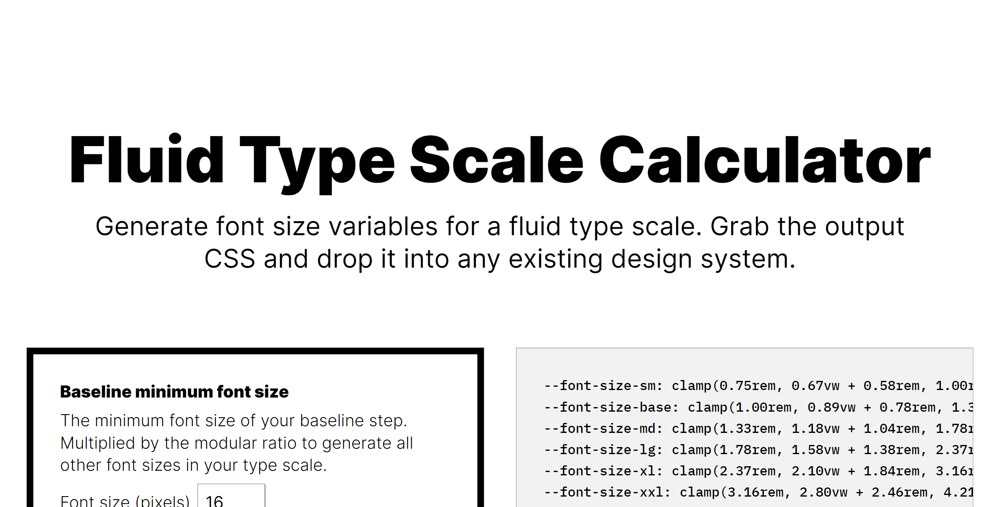

# Fluid Type Scale Generator

> Generate font size variables for a fluid type scale.

Customize everything, grab the output CSS, and drop it into any existing design system.

## Motivation

Most apps do one of two things:

1. They generate fluid typography variables, which are great for responsive sizing.
2. They generate a type scale, which defines a harmonic relationship between font size steps.

Why not do both?

## Running Locally

1. Clone the repo.
2. Run `yarn` to install dependencies.
3. Run `yarn serve` and visit `localhost:8080` to view the app.

## Additional Resources

- [Type Scale](https://type-scale.com/) by Jeremy Church
- [Modern fluid typography editor](https://modern-fluid-typography.vercel.app/) by Adrian Bece
- [Generating `font-size` CSS Rules and Creating a Fluid Type Scale](https://moderncss.dev/generating-font-size-css-rules-and-creating-a-fluid-type-scale/) by Stephanie Eckles
- [Consistent, Fluidly Scaling Type and Spacing](https://css-tricks.com/consistent-fluidly-scaling-type-and-spacing/) by Andy Bell
